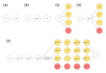

# Neural hierarchical models of ecological populations

Preprint: https://www.biorxiv.org/content/10.1101/759944v1?rss=1

### Key idea

Parameterize a hierarchical model (an observation + process + parameter model) with a neural network, creating a **neural hierarchical model**.



Here, (a) shows linear regression, mapping input x to an output y. 
In (b) a neural network inserts hidden layers between x and y.
Analogously, an ecological model (c) maps an input x to parameters of a hierarchical model.
A neural version of model (d) would similarly involve hidden layers between x and these parameters. 
Deep models (e) can also be constructed that use more complex neural architectures, especially when data are structured in time, space, and/or over networks. 


## Hardware requirements

- 20+ GB of RAM
- 4 or more CPU cores
- GPU recommended

## Setting up the environment

This project uses [conda](https://docs.conda.io/en/latest/) to install python dependencies.

```
conda env create -f environment.yml
```

Once installed, activate the environment via:

```
conda activate neural-ecology
```

To install R dependencies:

```
R -e "devtools::install_deps(dependencies = TRUE)"
```

## Running the toy models

This repo comes with toy models in Jupyter notebooks:

- [A neural occupancy model](simple-occupancy.ipynb)
- [A neural dynamic occupancy model](dynamic-occupancy.ipynb)
- [A neural N-mixture model](n-mixture-model.ipynb)
- [A deep Markov model for capture-recapture data](hidden-markov-model.ipynb)

## Building the paper

```
make
```

