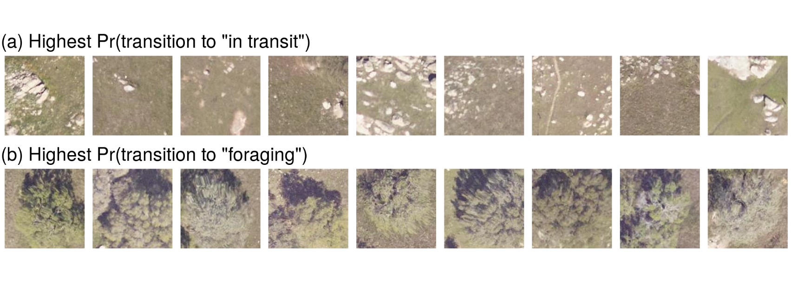

```{r setup, include=FALSE}
knitr::opts_chunk$set(echo = FALSE)
```


## If you only remember one thing...


\begin{center}
  \scalebox{2}{%
    $X \beta \rightarrow NN_{\theta}(X)$%
  }
\end{center}

\;

You can replace affine transforms ($X \beta$) with neural networks. 


## Hierarchical models predict states from data \footnote[frame]{\tiny{Berliner LM. Hierarchical Bayesian time series models. Maximum entropy and Bayesian methods 1996: 15-22}}


\begin{center}
\begin{tikzpicture}
\node (states) [par] {States};
\node (parameters) [par, left of=states, xshift=-2cm, yshift=2cm]{Parameters};
\node (observations) [whitebox, right of=states, above of=states, xshift=2cm, yshift=1cm] {Observations};
\draw [arrow] (states) -- (observations);
\draw [arrow] (parameters) -- (observations);
\draw [arrow] (parameters) -- (states);
\end{tikzpicture}
\end{center}


## Occupancy models are hierarchical\footnote[frame]{\tiny{MacKenzie, Darryl I., et al. "Estimating site occupancy rates when detection probabilities are less than one." Ecology 83.8 (2002): 2248-2255.}} 

\begin{center}
\begin{tikzpicture}
\node (process) [par] {Occupancy state $z$};
\node (data) [whitebox, right of=process, above of=process, xshift=2cm, yshift=1cm] {Detection data $y$};
\node (p) [par, left of=process, xshift=-2.5cm, yshift=2cm]{$p$};
\node (psi) [par, left of=process, xshift=-2.5cm]{$\psi$};
\draw [arrow] (p) -- (data);
\draw [arrow] (process) -- (data);
\draw [arrow] (psi) -- (process);
\end{tikzpicture}
\end{center}

$$y \sim \text{Bernoulli}(z \times p)$$

$$z \sim \text{Bernoulli}(\psi)$$

## Parameters can depend on covariates

e.g, $f$ maps covariates $X$ to occupancy probability $\psi$:

$$\psi = f(X; \theta).$$

## Often we assume linear relationships

e.g., linear on the logit scale:

$$\psi = \text{logit}^{-1}(X \beta).$$
$\quad$

\begin{center}
\begin{tikzpicture}
  % linear mapping
  \tikzstyle{every pin edge}=[<-,shorten <=1pt]
  \tikzstyle{input neuron}=[neuron, draw=black, fill=white];
  \tikzstyle{output neuron}=[neuron, draw=black, fill=AlertOrange!50!white];
  \tikzstyle{annot} = [text width=4em, text centered]
  
  % Draw the input layer nodes
  \foreach \name / \y in {1,...,4}
  % This is the same as writing \foreach \name / \y in {1/1,2/2,3/3,4/4}
      \node[input neuron] (I-\name) at (0,-\y) {$x_{\y}$};
  
  % Draw the output layer node
  \node[output neuron, right of=I-2, above of=I-3, xshift=1cm, yshift=-0.45cm] (O) {$\psi$};
  
  % Connect every node in the hidden layer with the output layer
  \foreach \source in {1,...,4}
      \draw (I-\source) edge (O);

\end{tikzpicture}
\end{center}

## Generally we are approximating a function

e.g., using some function $f$ parameterized by $\theta$:

$$\psi = f_\theta(X).$$
$\quad$

\begin{center}
\begin{tikzpicture}
  % linear mapping
  \tikzstyle{every pin edge}=[<-,shorten <=1pt]
  \tikzstyle{input neuron}=[neuron, draw=black, fill=white];
  \tikzstyle{output neuron}=[neuron, draw=black, fill=AlertOrange!50!white];
  \tikzstyle{annot} = [text width=4em, text centered]
  
  % Draw the input layer nodes
  \foreach \name / \y in {1,...,4}
  % This is the same as writing \foreach \name / \y in {1/1,2/2,3/3,4/4}
      \node[input neuron] (I-\name) at (0,-\y) {$x_{\y}$};
  
  % Draw the output layer node
  \node[output neuron, right of=I-2, above of=I-3, xshift=1cm, yshift=-0.45cm] (O) {$\psi$};
  
  % Connect every node in the hidden layer with the output layer
  \foreach \source in {1,...,4}
      \draw (I-\source) edge (O);

\end{tikzpicture}
\end{center}

## We can accommodate nonlinearity

- Polynomials
- Splines
- Random fields
- Gaussian processes
- Tree-based methods (random forest, XGBoost)
- **Neural networks?**

## Neural networks approximate functions

\begin{center}
\begin{tikzpicture}
\tikzstyle{every pin edge}=[<-,shorten <=1pt]
\tikzstyle{input neuron}=[neuron, draw=black, fill=white];
\tikzstyle{output neuron}=[neuron, draw=black, fill=white];
\tikzstyle{hidden neuron}=[neuron, draw=black, fill=UniBlue!50!white];
\tikzstyle{annot} = [text width=4em, text centered]

% Draw the input layer nodes
\foreach \name / \y in {1,...,4}
% This is the same as writing \foreach \name / \y in {1/1,2/2,3/3,4/4}
    \node[input neuron] (I-\name) at (0,-\y) {$x_{\y}$};

% Draw the hidden layer nodes
\foreach \name / \y in {1,...,5}
    \path[yshift=0.5cm]
        node[hidden neuron] (H-\name) at (\layersep,-\y cm) {$h_{\y}$};

% Draw the output layer node
\node[output neuron, right of=H-3, xshift=1cm] (O) {$\hat y$};

% Connect every node in the input layer with every node in the
% hidden layer.
\foreach \source in {1,...,4}
    \foreach \dest in {1,...,5}
        \path (I-\source) edge (H-\dest);

% Connect every node in the hidden layer with the output layer
\foreach \source in {1,...,5}
    \path (H-\source) edge (O);
    
\end{tikzpicture}
\end{center}

$\hat y:$ observable data 

e.g., bounding boxes, species identity, key points, a number, words

## 

Neural networks can do more than just predict data

$\;$

\begin{center}
\begin{tikzpicture}
\tikzstyle{every pin edge}=[<-,shorten <=1pt]
\tikzstyle{input neuron}=[neuron, draw=black, fill=white];
\tikzstyle{output neuron}=[neuron, draw=black, fill=AlertOrange!50!white];
\tikzstyle{hidden neuron}=[neuron, draw=black, fill=UniBlue!50!white];
\tikzstyle{annot} = [text width=4em, text centered]

% Draw the input layer nodes
\foreach \name / \y in {1,...,4}
% This is the same as writing \foreach \name / \y in {1/1,2/2,3/3,4/4}
    \node[input neuron] (I-\name) at (0,-\y) {$x_{\y}$};

% Draw the hidden layer nodes
\foreach \name / \y in {1,...,5}
    \path[yshift=0.5cm]
        node[hidden neuron] (H-\name) at (\layersep,-\y cm) {$h_{\y}$};

% Draw the output layer node
\node[output neuron, right of=H-3, xshift=1cm] (O) {$\theta$};

% Connect every node in the input layer with every node in the
% hidden layer.
\foreach \source in {1,...,4}
    \foreach \dest in {1,...,5}
        \path (I-\source) edge (H-\dest);

% Connect every node in the hidden layer with the output layer
\foreach \source in {1,...,5}
    \path (H-\source) edge (O);

\end{tikzpicture}
\end{center}

## 

e.g., neural network in an occupancy model\footnote[frame]{\tiny{Joseph MB. 2020. \textit{Neural hierarchical models of ecological populations}. Ecology Letters, 23(4) and Seo E et al. \textit{StatEcoNet: Statistical Ecology Neural Networks for Species Distribution Modeling}. Proceedings of the AAAI Conference on Artificial Intelligence, 35(1).}} 

$\;$

\begin{center}
\begin{tikzpicture}
\tikzstyle{every pin edge}=[<-,shorten <=1pt]
\tikzstyle{input neuron}=[neuron, draw=black, fill=white];
\tikzstyle{output neuron}=[neuron, draw=black, fill=AlertOrange!50!white];
\tikzstyle{hidden neuron}=[neuron, draw=black, fill=UniBlue!50!white];
\tikzstyle{annot} = [text width=4em, text centered]

% Draw the input layer nodes
\foreach \name / \y in {1,...,4}
% This is the same as writing \foreach \name / \y in {1/1,2/2,3/3,4/4}
    \node[input neuron] (I-\name) at (0,-\y) {$x_{\y}$};

% Draw the hidden layer nodes
\foreach \name / \y in {1,...,5}
    \path[yshift=0.5cm]
        node[hidden neuron] (H-\name) at (\layersep,-\y cm) {$h_{\y}$};

% Draw the output layer node
\node[output neuron, right of=H-3, xshift=1cm] (O) {$\psi$};

% Draw other hierarchical model components
\node[output neuron, above of=O] (p) {$p$};
\node[output neuron,label=below:\tiny Occupancy, right of=O] (z) {$z$};
\node[input neuron,label=above:\tiny Detection data, above of=z, right of=z] (y) {$y$};

\path (O) edge (z);
\path (z) edge (y);
\path (p) edge (y);


% Connect every node in the input layer with every node in the
% hidden layer.
\foreach \source in {1,...,4}
    \foreach \dest in {1,...,5}
        \path (I-\source) edge (H-\dest);

% Connect every node in the hidden layer with the output layer
\foreach \source in {1,...,5}
    \path (H-\source) edge (O);

\end{tikzpicture}
\end{center}


## Example: convolutional animal movement model


## Parameterizing a hidden Markov model \newline with a convolutional neural network


## Performance is better with more data


## Test set predictions




## Parameter estimation

We observe $y_{1:N}$ and minimize loss:

$$\text{Loss}(\theta) = - \sum_{i} \underbrace{\ell(y_i, \theta)}_{\substack{\text{Log} \\ \text{probability}}} + \text{other stuff}$$

- Stochastic minibatch optimization


## Trade-offs: why you should (not) do this

**Good**

- feature extraction from images & time series
- scaling

**Not so good**

- interpretability
- implementation
- point estimates easy, posteriors hard


## Related work: tree-based function approximators\footnote[frame]{\tiny{Hutchinson, Rebecca, Li-Ping Liu, and Thomas Dietterich. "Incorporating boosted regression trees into ecological latent variable models." Proceedings of the AAAI Conference on Artificial Intelligence. Vol. 25. No. 1. 2011.}} 


\begin{center}
  \scalebox{2}{%
    $X \beta \rightarrow f_{\theta}(X),$%
  }
\end{center}

where $f$ is a **boosted regression tree**.


(speculation: better for tabular features?)\footnote[frame]{\tiny{Grinsztajn, Leo, Edouard Oyallon, and Gael Varoquaux. "Why do tree-based models still outperform deep learning on typical tabular data?." Thirty-sixth Conference on Neural Information Processing Systems Datasets and Benchmarks Track. 2022.}}


## Science-based deep learning

### Universal differential equations\footnote[frame]{\tiny{Rackauckas, Christopher, et al. "Universal Differential Equations for Scientific Machine Learning." arXiv preprint arXiv:2001.04385 (2020).}}

$$u' = \text{NN}_\theta(u, t)$$
where $u$ is a state, and $\text{NN}_\theta$ is a neural net.


## Science-based deep learning

### Physics-guided neural networks\footnote[frame]{\tiny{Karpatne, Anuj, et al. "Physics-guided neural networks (pgnn): An application in lake temperature modeling." arXiv preprint arXiv:1710.11431 (2017).}}

$$\text{Loss} = \text{Error} + \text{Model complexity} + \text{Physical inconsistency}$$

## Interactive examples: \newline github.com/mbjoseph/neuralecology

[](https://mybinder.org/v2/gh/mbjoseph/neuralecology/master)

- Site-occupancy model 
- Dynamic occupancy model
- N-mixture model
- Capture-recapture model\

## Thank you


\small
**Get in touch:** max.joseph@ncx.com, @mxwlj

\normalsize

### Code

https://github.com/mbjoseph/neuralecology

### Paper

Joseph MB. 2020. Neural hierarchical models of ecological populations. Ecology Letters, 23(4).

